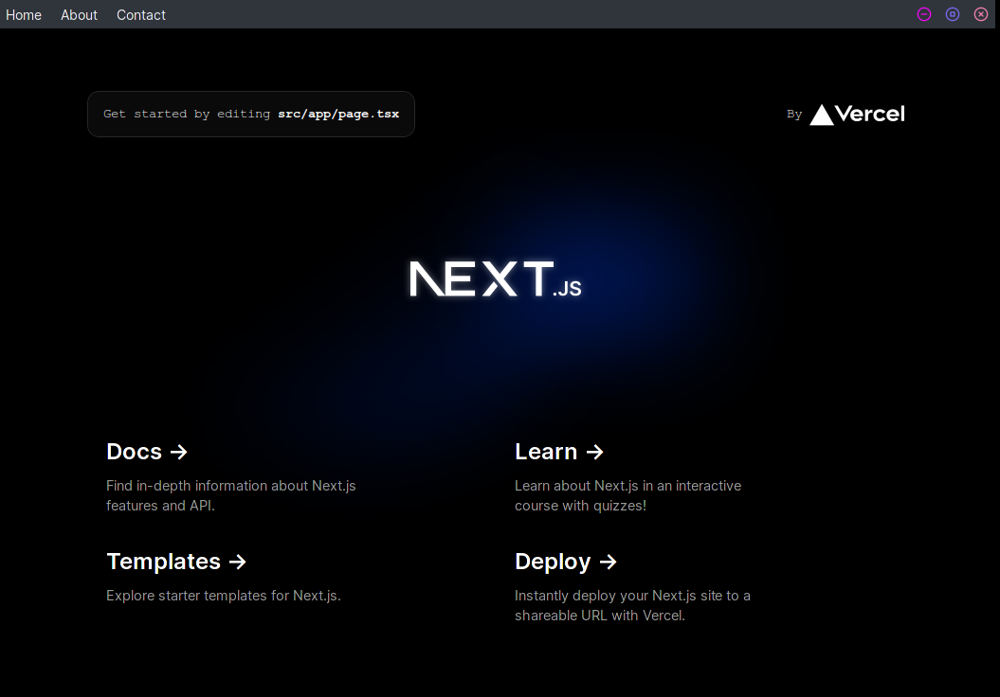

# Aplicação desktop - tauri + next js
Uma aplicação next js 14 padrão com tauri

## 🚀 Motivaçao / objetivo

Customizar o menu nativo das janelas. Dexiar o menu da aplicação na barra superior da janela, mais conhecida como TITLEBAR.
Você pode visitar a documentação e verificar como tauri realiza algumas customizações mesclando códgio RUST com react js [Documentação](https://tauri.app/v1/guides/features/window-customization)

<h1 align="center">
    
</h1>

## 💻 Requisitos

Antes de iniciar, você deve ter o Node.js e o YARN instalados em sua máquina.

## 🚀 Instalando

Primeiro, você deve clonar o projeto na sua máquina, para isso você
pode colar o seguinte comando em seu terminal

```bash
git clone https://github.com/Tiago-Silva/frontend-cardapio.git](https://github.com/Tiago-Silva/tauri-nextjs-desktop.git
```
Para instalar as dependências, execute o seguinte comando:

```bash
yarn install
```

Por fim, para executar o projeto basta rodar o seguinte:

```bash
yarn tauri dev
```

## 🔧 Compilação

Para compilar a aplicação para produção, execute o seguinte comando:

```bash
yarn tauri build
```
Isso irá gerar uma versão otimizada da aplicação na pasta `out`.

### Features

Tecnologias usadas nesse projeto:

 ⚡ [Next.js](https://nextjs.org)
- 🔥 Type checking [TypeScript](https://www.typescriptlang.org)
- ✅ Styled-components [Styled-Componest](https://styled-components.com/)
- ⌨️ [React js](https://pt-br.legacy.reactjs.org/)
- 📏 Linter with [ESLint](https://eslint.org) (default NextJS, NextJS Core Web Vitals, Tailwind CSS and Airbnb configuration)
- 💖 Code Formatter with [Prettier](https://prettier.io)
- 🚫 [Tauri](https://tauri.app/)

## 📝 Licença

Este projeto está licenciado sob a licença MIT. Consulte o arquivo `LICENSE` para obter mais informações.
